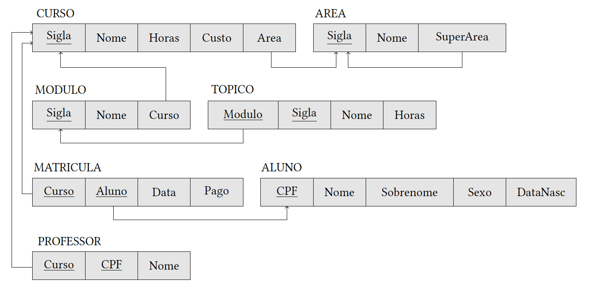

# Pergunta

Construir um diagrama de implementação do banco de dados SAM a partir do modelo relacional abaixo e especificar consultas em SQL para criar o esquema, as tabelas e restrições (domínio, nulidade, unicidade, valor, valor padrão, chave e integridade referencial) do banco de dados SAM.

1. Diagrama Pé de Galinha
2. Consulta de criação das tabelas

