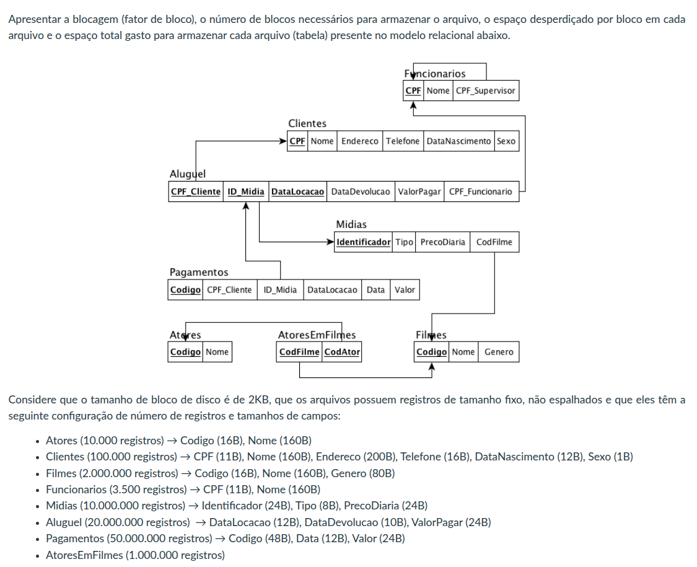

# Pergunta

# Resposta 

## Parâmetros Gerais
- **Valor de Cada Bloco:** 2Kb ou 2048B

### Atores
- **Valor do Registro:** 176B
- **Quantidade de Registros por Bloco:** 2048 / 176 = *11*
- **Nº de Blocos Existentes:** 10000 / 11 = *909*
- **Espaço Desperdiçado:** 2048 - (176 * 11) = *112B*
- **Consumo Total de Espaço:** 909 * 2048 = *1861632B ou 1818Kb*

### Clientes
- **Valor do Registro:** 400B
- **Quantidade de Registros por Bloco:** 2048 / 400 = *5*
- **Nº de Blocos Existentes:** 100000 / 5 = *20000*
- **Espaço Desperdiçado:** 2048 - (400 * 5) = *48B*
- **Consumo Total de Espaço:** 20000 * 2048 = *40000Kb*

### Filmes
- **Valor do Registro:** 256B
- **Quantidade de Registros por Bloco:** 2048 / 256 = *8*
- **Nº de Blocos Existentes:** 2000000 / 8 = *250000*
- **Espaço Desperdiçado:** 2048 - (256 * 8) = *0B*
- **Consumo Total de Espaço:** 250000 * 2048 = *500000Kb*

### Funcionários
- **Valor do Registro:** 171B
- **Quantidade de Registros por Bloco:** 2048 / 171 = *11*
- **Nº de Blocos Existentes:** 3500 / 11 = *318*
- **Espaço Desperdiçado:** 2048 - (171 * 11) = *167B*
- **Consumo Total de Espaço:** 318 * 2048 = *651Kb*

### Midias
- **Valor do Registro:** 56B
- **Quantidade de Registros por Bloco:** 2048 / 56 = *36*
- **Nº de Blocos Existentes:** 10000000 / 36 = *277778*
- **Espaço Desperdiçado:** 2048 - (56 * 36) = *32B*
- **Consumo Total de Espaço:** 277778 * 2048 = *569444Kb*

### Aluguel
- **Valor do Registro:** 46B
- **Quantidade de Registros por Bloco:** 2048 / 46 = *44*
- **Nº de Blocos Existentes:** 20000000 / 44 = *454545*
- **Espaço Desperdiçado:** 2048 - (46 * 44) = *32B*
- **Consumo Total de Espaço:** 454545 * 2048 = *930909Kb*

### Pagamentos
- **Valor do Registro:** 84B
- **Quantidade de Registros por Bloco:** 2048 / 84 = *24*
- **Nº de Blocos Existentes:** 50000000 / 24 = *2083333*
- **Espaço Desperdiçado:** 2048 - (84 * 24) = *32B*
- **Consumo Total de Espaço:** 2083333 * 2048 = *4266666Kb*

### AtoresEmFilmes
- **Valor do Registro:** (Estimado) 16B (Código Ator) + 16B (Código Filme) = *32B*
- **Quantidade de Registros por Bloco:** 2048 / 32 = *64*
- **Nº de Blocos Existentes:** 1000000 / 64 = *15625*
- **Espaço Desperdiçado:** 2048 - (32 * 64) = *0B*
- **Consumo Total de Espaço:** 15625 * 2048 = *32031Kb*
